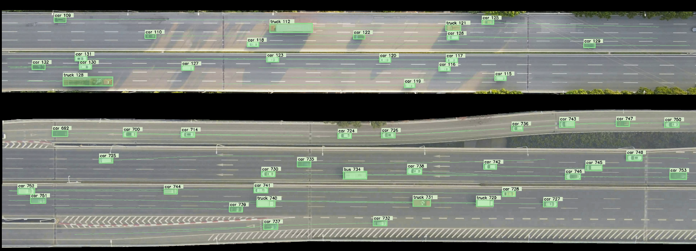

# Description:
This repository contains: 1)The codes of the vehicle trajectory generation from multiple aerial videos and trajectory biases evaluation. 2) The download website of the trajectory datasets constructed from single and multiple aerial videos.
#### Video frame demo:

#### Single video demo:

#### Multiple Video demo:

# Download website:
[Dataport] : Yi He, Bo Cao, Ching-Yao Chan, November 29, 2022, "WUT-NGSIM: A High-Precision and Trustworthy Vehicle Trajectory Dataset", IEEE Dataport, doi: https://dx.doi.org/10.21227/hmsb-ka76.

[Download] : WUT-NGSIM dataset download at baiducloud: https://pan.baidu.com/s/1X3W8t81y4-NuuCj_75jgEQ?pwd=gq8z password: gq8z

# Research papers:
[Paper] : Y. He, B. Cao, C. Y. Chan, Y. Li, X. Xia, and H. Huang, "Multiple Aerial Videos-based Long-Distance Vehicle Trajectory Construction with Spatiotemporal Continuity," IEEE Trans. Intell. Veh., pp. 1-13, 2024, doi: 10.1109/TIV.2024.3451722.

[Paper] : Bo Cao, Yi He, Changxin Sun, Jipu Li. Biases in Aerial Video-Based Vehicle Trajectory Generation: An Empirical Evaluation ( in review).